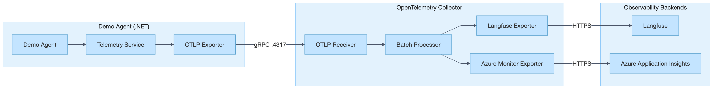

# Agent Observability

An educational project for learning about **OpenTelemetry** instrumentation for AI agents and implementing **evaluations** (evals) for LLM-based applications.

## Purpose

This project demonstrates:

- **OpenTelemetry Integration**: How to instrument AI agents with distributed tracing using OpenTelemetry semantic conventions
- **Multi-Backend Export**: Sending telemetry data to multiple observability backends simultaneously (Langfuse + Azure Application Insights)
- **Agent Evals**: Running experiments against datasets and evaluating agent performance with custom evaluators
- **LLM Observability Patterns**: Tracing generations, tool calls, chains, and agent loops

## Demo Setup



### Data Flow

1. **Agent** generates traces using OpenTelemetry SDK with GenAI semantic conventions
2. **OTLP Exporter** sends traces to the OpenTelemetry Collector via gRPC
3. **Collector** batches and forwards traces to multiple backends:
   - **Langfuse**: For LLM-specific observability, prompt management, and evals
   - **Azure Application Insights**: For APM, dashboards, and alerting

## Project Structure

```
agent-observability/
├── agent-core/              # Core agent abstractions
│   ├── ChatCompletion/      # Chat completion interfaces and models
│   ├── Prompts/             # Prompt provider interfaces
│   ├── Providers/           # OpenAI provider, Langfuse prompt provider
│   └── Tools/               # Tool registry and execution
│
├── agent-telemetry/         # OpenTelemetry instrumentation
│   ├── Services/            # AgentTelemetry implementation
│   ├── Models/              # TelemetryScope, GenerationScope
│   └── Constants/           # GenAI semantic attributes
│
├── agent-evals/             # Evaluation framework
│   ├── Evaluators/          # NLP and trajectory evaluators
│   ├── Services/            # ExperimentRunner, EvaluationRunner
│   └── Models/              # EvaluationContext, EvaluationResult
│
├── agent-cli/               # CLI utilities for interactive chat
│
├── demo/
│   └── manual-instrumented-agent/   # Demo agent with manual instrumentation
│       ├── Commands/        # CLI commands (chat, experiment, evaluate)
│       └── Tools/           # Sample tools (dice, cards)
│
├── docker-compose.yml       # OpenTelemetry Collector setup
├── otel-collector-config.yaml
└── env.template             # Environment variables template
```

## Prerequisites

- [.NET 8 SDK](https://dotnet.microsoft.com/download/dotnet/8.0)
- [Docker](https://www.docker.com/get-started) (for OpenTelemetry Collector)
- OpenAI API key
- Langfuse account (free tier available at [cloud.langfuse.com](https://cloud.langfuse.com))
- (Optional) Azure Application Insights resource

## Setup

### 1. Configure Environment Variables

Copy the environment template and fill in your credentials:

```bash
cp env.template .env
```

Edit `.env` with your values:

```env
# Langfuse - Base64 encode your keys: echo -n "pk-lf-xxx:sk-lf-xxx" | base64
LANGFUSE_BASE_URL=https://cloud.langfuse.com
LANGFUSE_AUTH=<base64-encoded-public:secret>

# Azure Application Insights (optional)
APPLICATIONINSIGHTS_CONNECTION_STRING=<your-connection-string>
```

### 2. Configure the Demo Agent

Create `demo/manual-instrumented-agent/appsettings.local.json`:

```json
{
  "OpenAI": {
    "ApiKey": "sk-..."
  },
  "Langfuse": {
    "PublicKey": "pk-lf-...",
    "SecretKey": "sk-lf-..."
  }
}
```

### 3. Start the OpenTelemetry Collector

```bash
docker-compose up -d
```

Verify it's running:

```bash
docker-compose logs otel-collector
```

## Running the Demo

### Interactive Chat

Start a chat session with the agent:

```bash
cd demo/manual-instrumented-agent
dotnet run
```

Or explicitly run the chat command:

```bash
dotnet run -- chat
```

The agent has access to sample tools (dice rolling, card dealing) and all interactions are traced to your configured backends.

### Run an Experiment

Execute the agent against a Langfuse dataset:

```bash
dotnet run -- experiment --dataset <dataset-name>
```

Options:
- `--dataset` or `-d`: Name of the Langfuse dataset to run against
- `--run` or `-r`: Custom name for this experiment run

### Evaluate a Run

Evaluate a completed experiment run:

```bash
dotnet run -- evaluate --dataset <dataset-name> --run <run-name>
```

Options:
- `--dataset` or `-d`: Name of the dataset
- `--run` or `-r`: Name of the run to evaluate

## Viewing Traces

### Langfuse

1. Go to [cloud.langfuse.com](https://cloud.langfuse.com)
2. Navigate to **Traces** to see agent executions
3. Click on a trace to see the full hierarchy:
   - Root trace (session)
   - Agent span
   - Generation spans (LLM calls)
   - Tool spans

### Azure Application Insights

1. Go to your Application Insights resource in Azure Portal
2. Navigate to **Transaction Search** or **Application Map**
3. Use **End-to-end transaction details** to explore distributed traces

## Key Concepts

### OpenTelemetry Semantic Conventions

This project follows [GenAI semantic conventions](https://opentelemetry.io/docs/specs/semconv/gen-ai/) for LLM observability:

| Attribute | Description |
|-----------|-------------|
| `gen_ai.system` | The AI provider (e.g., "openai") |
| `gen_ai.request.model` | Model used for generation |
| `gen_ai.operation.name` | Type of operation (chat, tool, etc.) |
| `gen_ai.usage.input_tokens` | Input token count |
| `gen_ai.usage.output_tokens` | Output token count |

### Trace Hierarchy

```
Trace: "Manual Agent"
└── Agent: "Manual Agent"
    ├── Chain: "Call LLM"
    │   └── Generation: "gpt-4o-mini"
    ├── Chain: "Tools"
    │   └── Tool: "roll_dice"
    └── Chain: "Call LLM"
        └── Generation: "gpt-4o-mini"
```

### Evaluators

The `agent-evals` library includes:

- **NLP Evaluators**: Semantic similarity, keyword matching, response length
- **Trajectory Evaluators**: Tool usage validation, step counting, expected behavior verification

## Development

### Building All Projects

```bash
dotnet build
```

### Adding Custom Tools

1. Create a tool class in `demo/manual-instrumented-agent/Tools/`
2. Decorate with `[Tool]` attribute
3. Register in `DemoAgent.cs`

Example:

```csharp
[Tool("my_tool", "Description of what the tool does")]
public class MyTool
{
    public static string Execute(string param1, int param2)
    {
        return $"Result: {param1}, {param2}";
    }
}
```

## Troubleshooting

### Collector Not Receiving Traces

1. Check collector logs: `docker-compose logs otel-collector`
2. Verify the agent is pointing to `localhost:4317`
3. Ensure no firewall is blocking the port

### Traces Not Appearing in Langfuse

1. Verify your `LANGFUSE_AUTH` is correctly base64 encoded
2. Check collector logs for HTTP errors
3. Ensure your Langfuse keys have the correct permissions

### Azure Monitor Export Failing

1. Verify your connection string is complete
2. Check for firewall/network restrictions
3. Review collector logs for specific error messages

## Resources

- [OpenTelemetry .NET SDK](https://opentelemetry.io/docs/languages/net/)
- [GenAI Semantic Conventions](https://opentelemetry.io/docs/specs/semconv/gen-ai/)
- [Langfuse Documentation](https://langfuse.com/docs)
- [Azure Monitor OpenTelemetry](https://learn.microsoft.com/en-us/azure/azure-monitor/app/opentelemetry-overview)

## License

This project is for educational purposes.
